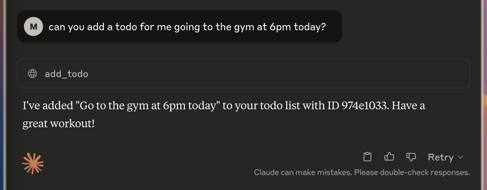
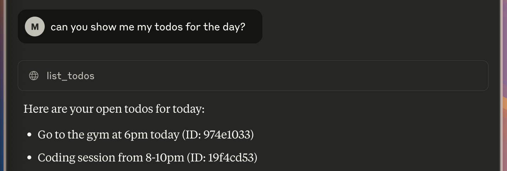
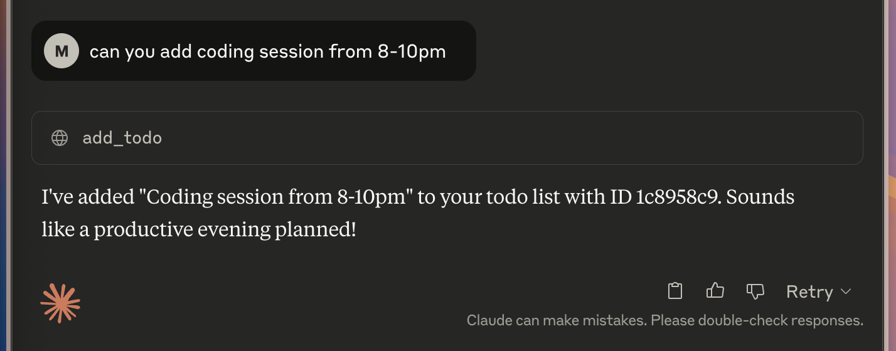
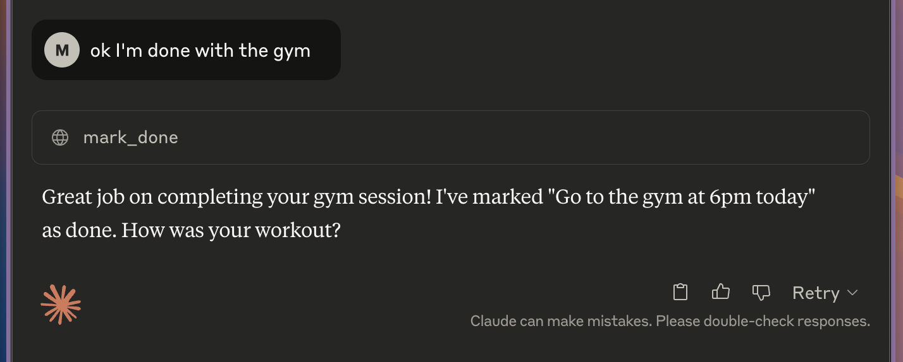

# 📝 MCP ToDo Server
A lightweight Model Context Protocol (MCP) server designed for managing ToDos. Easily integrated into the Claude Desktop environment or used standalone with mcp dev. Built with simplicity, persistence, and user-guided interaction in mind.




## ✨ Features
- Add, list, complete, and delete ToDos via AI commands
- JSON file-based persistence in a dedicated Data/ folder
- Natural-language prompt for summarizing all ToDos
- Ready-to-use with Claude Desktop (via mcp install) or mcp dev

## 🚀 Quick Start
### 📦 Installation
It is recommended using [uv](https://github.com/astral-sh/uv), so make sure you have **uv** installed. Generally, for more information regarding MCP checkout [MCP Python SDK](https://github.com/modelcontextprotocol/python-sdk).

Clone this repo then:
```bash
uv sync
```

### ▶️ Running the Server / Adding to Claude Desktop Config
With uv:
```bash
uv run mcp install server.py
```
Or directly:
```bash
mcp install server.py
```
To test in development mode with logging:
```bash
mcp dev server.py
```
> [!NOTE]
> 🧠 Note: When using Claude Desktop, ensure the app is properly restarted after installing a new server.
>
> Find more information on [MCP Quickstart](https://modelcontextprotocol.io/quickstart/user)

## 📂 Data Storage
All ToDos are stored in Data/todos.json inside this repo. This file is automatically created on first run.

Each ToDo includes:
- id: Unique short identifier
- message: Task description
- created_at: Timestamp
- done: Boolean flag
- done_at: Completion time (if any)

## 🛠️ Provided Tools
| Tool Name    | Description |
| -------- | ------- |
| add_todo  | Add a new ToDo with message & timestamp   |
| list_todos | List all or only open ToDos    |
| mark_done    | Mark a ToDo as completed    |
| delete_todo    | Permanently delete a ToDo    |
| note_summary_prompt    | Generates a summary of all current tasks    |
| get_greeting    | Personalized greeting resource for users    |




## 🧰 Developer Notes
- This repo assumes a local folder Data/ for persistent storage.
- Code is written with extensibility in mind — add more tools as needed.
- Docstrings for each tool help the LLM decide when and how to use them.
